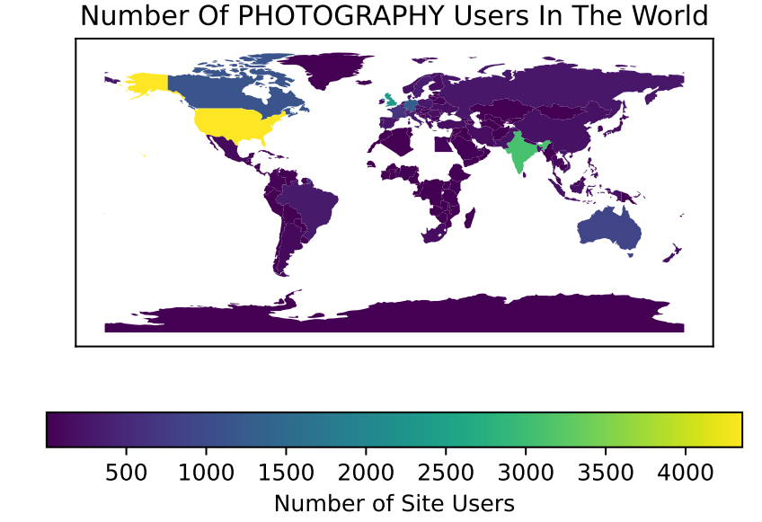
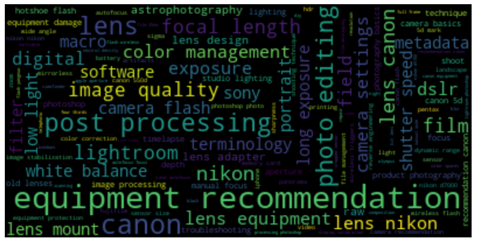
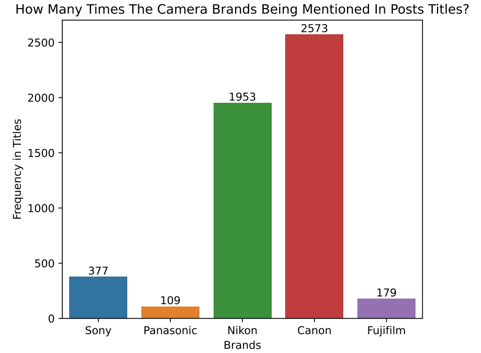

⭐ **Project Goal**

This project aims to take insights from several analyses by exploring the recent data dumps from the Photography Stack Exchange, and further visualising the output.

❗ **Challenges**

This project needs to do with data cleansing, applying a wide range of data frame wrangling and text
processing techniques, and demonstrating how to write regular expressions (regexes).

💪 **Sample Outputs**

The first step is to convert the relevant data tables from XML to CSV, and to load the CSVs as **pandas** data frames, and further visualising the insights. Here are some sample outputs from this study.

**Output 1** 

a world map showing where are the site users from

**Output 2**

a word cloud plot on the frequency of tags being used

**Output 3**

the frequency of brand names being mentioned in the post titles

